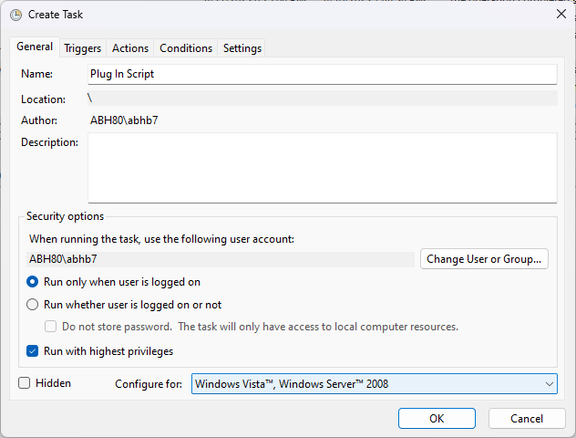
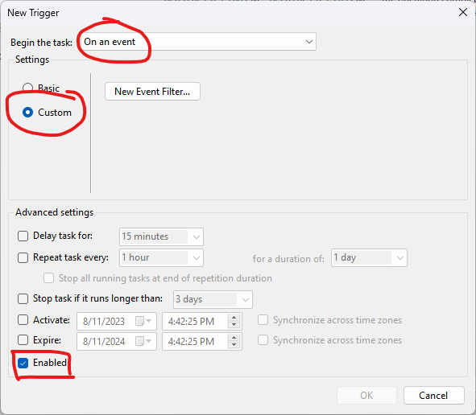
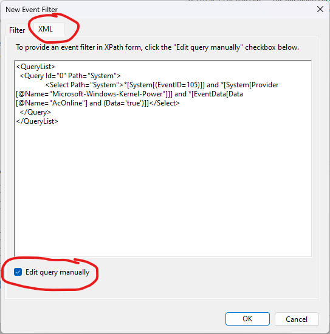
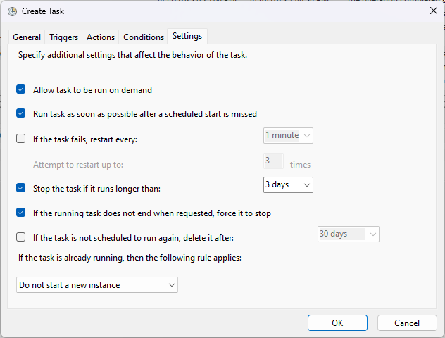
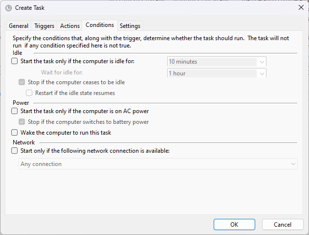
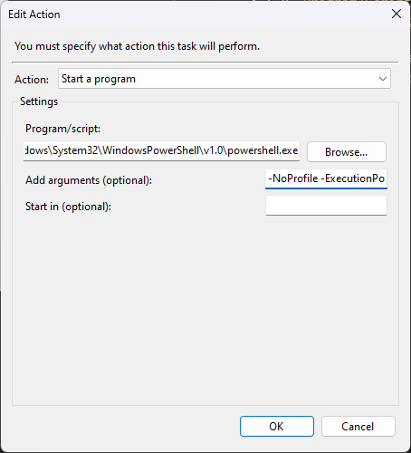

# windiws-gpu-management-script

Simple scripts to manage your GPU with Power Source. Turn GPU on when plugged in and turn GPU off when on battery!

Tired of gpu induced battery drain? Do this

> ⚠️ Tested only on Windows 10 and 11. Use at your own risk

# Usage

- Clone the repo or the two files named `disable_gpu.ps1` and `enable_gpu.ps1` (Both are independent of each other).
- Launch the `Task Scheduler` program on windows. (Preinstalled on all Windows version)
- Task Scheduler Library > Create Task
- Name is anything you want, I will name it `Plug In Script`. Enable the `Run with highest privileges option`

  

- Click on the `Triggers` tab > New > Select `On an event`. Check the highlighted areas in the ASSETS/image below then click on `New Event Filter`

  

- Select the `XML` tab and enable the `Edit query manually option`. Check the highlighted areas in the ASSETS/image below

  

- Paste the following for Plug In:

  ```xml
  <QueryList>
  <Query Id="0" Path="System">
  	<Select Path="System">*[System[(EventID=105)]] and *[System[Provider[@Name="Microsoft-Windows-Kernel-Power"]]] and *[EventData[Data[@Name="AcOnline"] and (Data='true')]]</Select>
  </Query>
  </QueryList>
  ```

- Click `Ok` then again `Ok` until you reach the `Create Task` window.
- Check the ASSETS/image below for `Settings` and `Conditions` tab. This will be same for both Plugin In and Out script.

  

  

- Click on `Actions` > `New`.
- In the `Program/Script` enter your powershell install location, by default it is `C:\Windows\System32\WindowsPowerShell\v1.0\powershell.exe`.
- In the `Add arguments` enter `-NoProfile -ExecutionPolicy Bypass -File "/path/to/enable_gpu.ps1" -Name "NVIDIA GeForce GTX 1650 Ti"` (replace `/path/to` and `NVIDIA GeForce GTX 1650 Ti` to your needs).

  

- Repeat the same for the `disable_gpu.ps1` with the changes as necessary.

    Use this query for the Step 7:

    ```xml
    <QueryList>
    <Query Id="0" Path="System">
	<Select Path="System">*[System[(EventID=105)]] and *[System[Provider[@Name="Microsoft-Windows-Kernel-Power"]]] and *[EventData[Data[@Name="AcOnline"] and (Data='false')]]</Select>
    </Query>
    </QueryList>
    ```


Thank you for following this guide. If you are like me who has to save battery on a gaming laptop then this is perfect.

# Credits

Big shoutout to this [reddit](https://www.reddit.com/r/Surface/comments/6coxgp/how_to_run_a_task_when_plugged_into_ac_or_losing/) post for providing with events!
